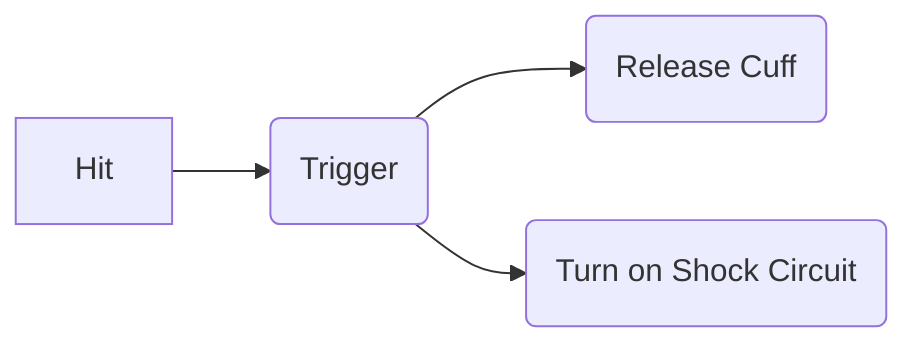

# TaSafe Circuit 

## Block Diagram 

## Trigger Circuit

// Image of trigger and at rear end we are attaching a push button on the trigger

We are using two mosfets, one P-Mosfet and another N-Mosfet. Gate is provided a path to ground using a tap button and is pulled up using a resistor of 1 M Ohm. The source of the P-mosfet is connected to the load i.e. the shock circuit ( and Arduino Nano to alert the police and relatives). To ensure that we have a lock "On" when the circuit is triggered. We have gate of  N-Mosfet connected to the source in parallel to the load.  When the N-Mos is turned "On", drain of this mosfet goes to around 0.2 V. This terminal is connected to the Gate of P-Mosfet. So when the push button is pressed it turns on the P-Mos which turns on the N-Mos and N-Mos makes the gate of the P-Mosfet grounded.

## Shock Circuit 

// Write about resistance of body with frequency

// Circuit diagram

We are using 555 timer circuit to generate the x Hz frequency digital wave. The output of the 555 timer is connected to a inductor that is coupled with another inductor. Rise and fall in digital waves generate high emf in the coupled inductors. And when our body touhes our body the other end of the inductor it completes the circuit and hence we receive shock.

